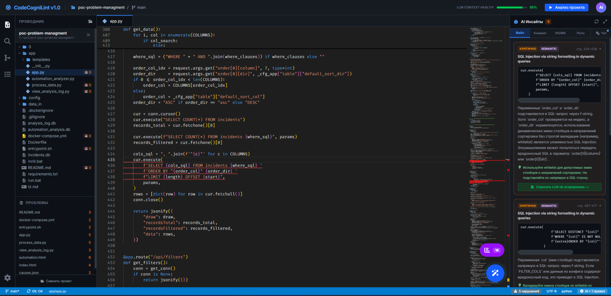

# CodeCogniLint

Гибридная система анализа кода для веба: статистика Git-истории + семантическое понимание LLM. IDE-подобный интерфейс с редактором Monaco, динамическими правилами и поддержкой как облачных, так и локальных моделей.



---

## Возможности

- **IDE-интерфейс** — Monaco Editor, табы файлов, дерево проводника, AI-панель, status bar
- **Открытие проектов** — локальная папка или клонирование Git-репозитория прямо из UI; список недавних проектов
- **Анализ файла** — LLM находит нарушения, Monaco подсвечивает строки squiggle-маркерами с ховер-описанием
- **Анализ всего проекта** — потоковый обход через SSE, прогресс в реальном времени, лимиты на размер/количество файлов
- **Точные номера строк** — двухслойная защита: префикс номеров в промпте + поиск `code_snippet` в реальном файле для коррекции
- **Динамические правила** — создание из выделенного кода через LLM или вручную через форму; включение/отключение, редактирование, удаление
- **Чат с LLM** — отдельная вкладка, контекст активного файла подмешивается автоматически; нормализация истории для строгих jinja-шаблонов
- **Multi-LLM** — LM Studio (локально), OpenAI, Anthropic; настройки сохраняются в `.env`

---

## Стек

| Слой       | Технологии                                       |
| ---------- | ------------------------------------------------ |
| Frontend   | React 19, TypeScript, Vite, Tailwind CSS v4      |
| Редактор   | Monaco Editor (`@monaco-editor/react`)           |
| Backend    | Python 3.11+, FastAPI, Uvicorn                   |
| LLM-клиент | OpenAI SDK (совместим с LM Studio, OpenAI, …)    |
| Git        | GitPython (clone)                                |
| Стриминг   | Server-Sent Events (`StreamingResponse`)         |

---

## Быстрый старт (Windows)

Установлены: **Node.js 18+**, **Python 3.11+**, **LM Studio** (для локального LLM) или ключ OpenAI/Anthropic.

```powershell
# 1. Установить зависимости (один раз)
cd frontend
npm install
cd ..\backend
python -m venv .venv
.\.venv\Scripts\pip install -r requirements.txt

# 2. Запуск обоих сервисов в отдельных окнах
.\start-all.bat
```

Откройте <http://localhost:3000>.

Альтернативно — по одному:

```powershell
.\start-frontend.bat   # http://localhost:3000
.\start-backend.bat    # http://localhost:8000  (API + Swagger на /docs)
```

---

## Настройка LLM

По умолчанию используется **LM Studio** на `http://localhost:1234/v1`:

1. Откройте LM Studio → вкладка **Developer**
2. Загрузите модель (например, `qwen2.5-coder-7b`, `llama-3.1-8b-instruct`)
3. Нажмите **Start Server**

Сменить провайдера/модель можно в UI: левая боковая панель → значок шестерёнки. Изменения сохраняются в `backend/.env`.

Файл `backend/.env.example` (копируется автоматически при первом запуске):

```env
LLM_PROVIDER=lmstudio
LLM_BASE_URL=http://localhost:1234/v1
LLM_MODEL=local-model
LLM_API_KEY=lm-studio

# Для облачных провайдеров:
# OPENAI_API_KEY=sk-...
# ANTHROPIC_API_KEY=sk-ant-...
```

---

## Использование

### Открытие проекта

В шапке проводника (или из пустого состояния) откройте пикер. Доступно три источника:

- **Локальная папка** — введите путь вручную или используйте «Обзор…» (серверный навигатор по дискам)
- **Git-репозиторий** — клонируется в `backend/projects/<имя>` (shallow clone, `depth=1`)
- **Недавние** — последние 8 проектов

### Анализ

- **Шапка → «Анализ проекта»** — SSE-обход всего workspace, бейджи 🤖N появляются на файлах в проводнике по мере прогресса
- **Floating-кнопка (волшебная палочка)** — анализ только текущего файла
- Результаты накапливаются в `resultsByFile` (per-path) — переключение между табами не теряет нарушения

### Правила

Три категории: **Синтаксис** (стиль), **Семантика** (логика), **Анализ** (безопасность / техдолг / Git-история).

**Создание из выделенного кода (LLM):**
ПКМ в редакторе по выделению → выбрать категорию → LLM генерирует `description` и `pattern_description`.

**Создание вручную (без LLM):**
Левая панель → Правила → кнопка «Новое правило». Форма с примерами для каждой категории, валидацией, переключателем активности.

**Редактирование:** карточка правила → «Изменить».
**Включение/отключение:** клик по кнопке статуса `● АКТИВНО` / `○ ОТКЛ.` (оптимистичный апдейт с откатом при ошибке).

Правила хранятся в `backend/.hybrid-rules.json`.

### AI-инсайты

Правая панель разделена на вкладки:

| Вкладка        | Содержимое                                                   |
| -------------- | ------------------------------------------------------------ |
| **Файл**       | Карточки нарушений с переходом к строке, кнопкой «Спросить LLM об исправлении» |
| Коммит / PR/MR / Репо | Заглушки — функциональность в разработке              |
| **Чат**        | Диалог с LLM (контекст активного файла), сообщения об ошибках, поле ввода |

---

## API

Бэк работает на `http://localhost:8000`, Swagger — `/docs`.

| Метод | Путь                              | Назначение                                |
| ----- | --------------------------------- | ----------------------------------------- |
| GET   | `/api/health`                     | Health-check                              |
| GET   | `/api/workspace`                  | Текущий проект + список недавних          |
| POST  | `/api/workspace/open`             | Открыть локальный путь                    |
| POST  | `/api/workspace/clone`            | Клонировать Git-репозиторий               |
| POST  | `/api/workspace/close`            | Закрыть текущий проект                    |
| GET   | `/api/workspace/tree`             | Дерево файлов (skip `.git`, `node_modules`, …) |
| GET   | `/api/workspace/file?path=...`    | Контент файла (с защитой от path traversal) |
| GET   | `/api/workspace/browse?path=...`  | Серверный пикер директорий                |
| GET   | `/api/rules`                      | Все правила                               |
| POST  | `/api/rules`                      | Создать вручную (без LLM)                 |
| POST  | `/api/rules/generate`             | Сгенерировать из фрагмента кода (LLM)     |
| PATCH | `/api/rules/{id}`                 | Обновить правило (в т.ч. `enabled`)       |
| DELETE| `/api/rules/{id}`                 | Удалить                                   |
| POST  | `/api/analysis/file`              | Анализ одного файла                       |
| GET   | `/api/analysis/repository/stream` | SSE: анализ всего проекта                 |
| POST  | `/api/analysis/chat`              | Чат с LLM (с нормализацией истории)       |
| GET   | `/api/settings`                   | Текущие настройки LLM                     |
| PUT   | `/api/settings`                   | Обновить настройки (с записью в `.env`)   |

---

## Структура проекта

```
CodeCogniLint/
├── backend/
│   ├── main.py                       # FastAPI app, CORS, регистрация роутеров
│   ├── requirements.txt
│   ├── .env(.example)                # настройки LLM
│   ├── .hybrid-rules.json            # хранилище правил
│   ├── .hybrid-workspace.json        # текущий проект + recent
│   ├── projects/                     # сюда клонируются git-репо
│   ├── routers/
│   │   ├── analysis.py               # /file, /repository/stream, /chat
│   │   ├── rules.py                  # CRUD правил + /generate (LLM)
│   │   ├── workspace.py              # open/clone/tree/file/browse
│   │   └── settings.py               # LLM-настройки + запись в .env
│   └── services/
│       ├── llm_adapter.py            # LLMError + friendly error mapping
│       ├── analysis_service.py       # построение промпта, snippet-based коррекция строк
│       ├── rules_service.py          # load/save/add/update/delete
│       └── workspace_service.py      # обход дерева, чтение, git clone
│
├── frontend/
│   ├── vite.config.ts                # прокси /api → :8000
│   └── src/
│       ├── App.tsx                   # композиция, табы, jump-to-line, диалоги
│       ├── components/
│       │   ├── Header.tsx
│       │   ├── ActivityBar.tsx
│       │   ├── Sidebar.tsx           # explorer / rules / settings
│       │   ├── EditorPane.tsx        # Monaco + контекстное меню + маркеры
│       │   ├── AIPanel.tsx           # 5 вкладок: scope + Чат
│       │   ├── FileTree.tsx          # рекурсивное дерево
│       │   ├── WorkspacePicker.tsx   # local / git clone / recent
│       │   ├── RuleCreatorDialog.tsx # из выделения (LLM)
│       │   ├── ManualRuleDialog.tsx  # вручную / редактирование
│       │   ├── AnalysisOverlay.tsx
│       │   └── StatusBar.tsx
│       ├── hooks/
│       │   ├── useRules.ts
│       │   ├── useAnalysis.ts        # одиночный + SSE репо
│       │   └── useWorkspace.ts
│       ├── services/api.ts           # axios-клиенты
│       └── types/index.ts
│
├── start-all.bat                     # запуск обоих сервисов
├── start-backend.bat
├── start-frontend.bat
└── claude.md                         # исходное ТЗ
```

---

## Архитектурные решения

- **Точность номеров строк** — LLM получает код с префиксом `   N |` для каждой строки + обязан возвращать `code_snippet`; бэк ищет snippet в исходнике и переписывает `line_start`/`line_end`. При множественных совпадениях выбирается ближайшее к гипотезе LLM
- **Защита от падений LM Studio** — `LLMError` с человекочитаемым русским описанием для типовых случаев («модель не загружена», «недоступен по адресу», и т.д.); ошибки попадают в Чат, не валят процесс
- **Нормализация истории чата** — для строгих jinja-шаблонов (Llama, Qwen) убираются дубль-system, orphan-assistant в начале, склеиваются подряд идущие сообщения одной роли
- **SSE-стриминг** — `text/event-stream` с `X-Accel-Buffering: no`, авто-стоп после 3 LLM-ошибок подряд
- **Path traversal** — `target.relative_to(root)` гарантирует, что `/api/workspace/file` не читает за пределами workspace; бинарники режутся по null-byte; лимит 5 МБ для редактора, 256 КБ для пакетного анализа
- **uvicorn `--reload-exclude`** — `projects/*` и `*.json` исключены из watcher'а, чтобы клонированные репо и изменения хранилищ не дёргали перезапуск

---

## Статус

**Реализовано:**
- Анализ файла и всего проекта
- Создание/редактирование/удаление/переключение правил
- Открытие локального проекта и клонирование Git
- Чат с LLM (с контекстом файла)
- Multi-LLM (LM Studio / OpenAI / Anthropic)

**В разработке:**
- Анализ конкретного коммита (`git diff` + LLM-комментарии)
- Анализ Pull / Merge Request (интеграция с GitHub/GitLab API)
- Сравнение нарушений между ветками
- Сохранение отредактированного контента на диск (сейчас изменения только в памяти; индикатор «dirty» уже есть)

---

## Лицензия

Учебный/исследовательский проект. Лицензия не определена.
